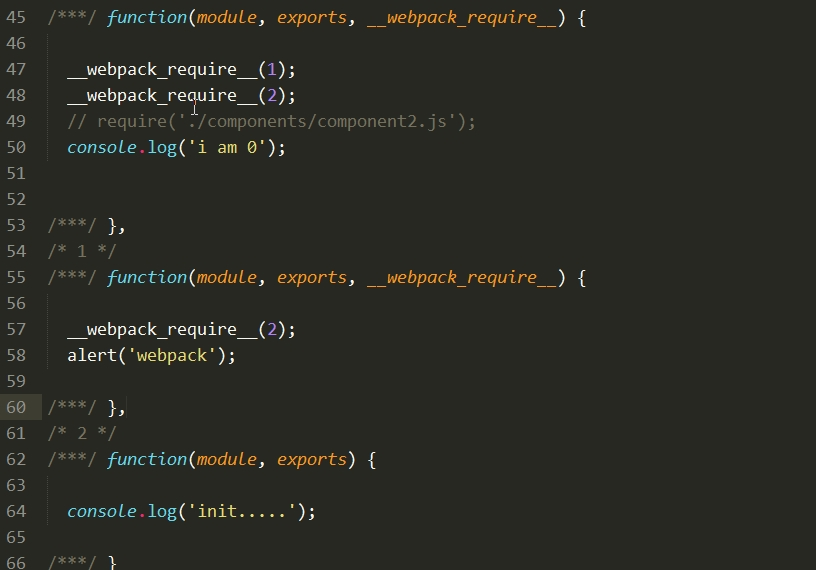

> webpack 打包输出的文件

查看webpack 打包编译输出后的文件可以看到每个编译后的js文件都有一个id值作为标识，也就是说我们可以通过这个id来查看相应的js文件编译后的代码. id的值根据require方法调用各js模块文件的顺序
编排，入口文件的id为*0*, 入口文件中首个使用*require()*方法的js文件id则为1，依次类推.每个js模块文件对应一个id，若模块中有相互引用，在编译后的文件中可看到*__webpack_require__(id)*的方式完成引用.



> ES6 加载器

``` shell
$ npm install babel-loader babel-core babel-preset-es2015 --save-dev
```
引用模块：

``` js
{
				test: /\.js$/,
				loader: 'babel?presets=es2015'
}
```

>  图片加载器

``` shell
$ npm install url-loader --save-dev
```

引用模块：
``` js
{
	test: /\.(png|jpg)$/,
  loader: 'url?limit=500000000&name=[hash].[ext]'
}
```

> css 加载器

``` js
npm install css-loader style-loader --save-dev
```

引入模块：

``` js
{
	test: /\.css$/, loader: "style-loader!css-loader"
}
```
> less

``` shell
$ npm install less-loader --save-dev
```

``` js
{
	test: /\.less/,
	loaders: ['style', 'css', 'less']
}
```
> extract-text-webpack-plugin提取css文件

``` js
npm install extract-text-webpack-plugin --save-dev
```

